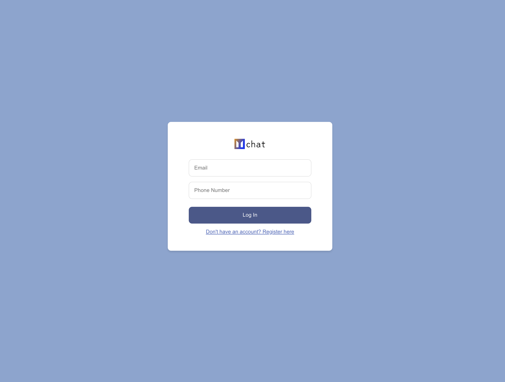
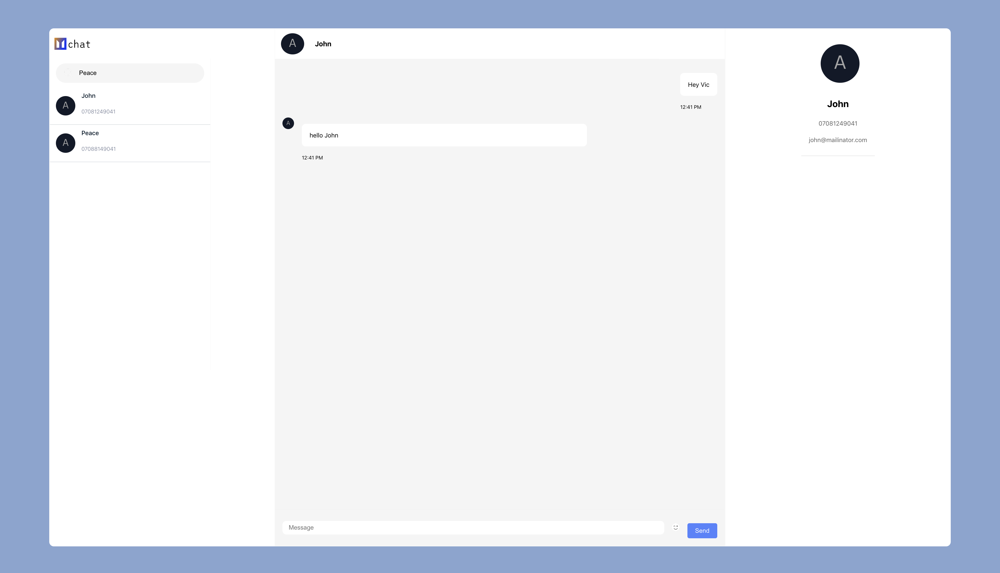

# Chat App

This repository contains the full-stack implementation of a chat application, including both the frontend and backend components. The project is built using React for the frontend and NestJS for the backend, with real-time messaging functionality powered by Socket.IO.






## Project Structure

The repository is organized into two main directories:

- `chat-app-frontend/`: Contains the React frontend application.
- `chat-app-backend/`: Contains the NestJS backend application.

## Features

### Frontend

- **User Interface**: A responsive UI built with React.
- **User Authentication**: Login and signup functionality (pending implementation).
- **Real-time Messaging**: Send and receive messages in real-time using Socket.IO.
- **User Search**: Search for other users to chat with.
- **Unread Messages Indicator**: Visual indicator for unread messages.

### Backend

- **User Registration and Authorization**: User registration, login, and profile management with JWT tokens.
- **Real-time Messaging**: Real-time messaging functionality using Socket.IO.
- **User Search**: Search users and manage contacts.
- **Database**: MongoDB Atlas for data persistence.

## Getting Started

### Prerequisites

Ensure the following are installed locally:

1. [Git](https://git-scm.com)
2. [Node.js](https://nodejs.org/)
3. [NPM](https://www.npmjs.com/)
4. [MongoDB Atlas](https://www.mongodb.com/cloud/atlas) account for database setup

## Setup and Installation

1. Clone the repository:

   ```bash
   git clone https://github.com/chuloWay/chat-app.git
   ```

2. Install Dependencies

    `npm run build`

3. Start App

    `npm run start`


### Thank You